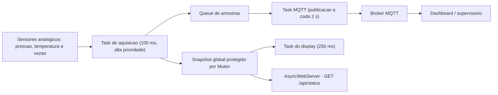

# RESPOSTAS - AULA09

Respostas elaboradas com base na progressao dos conteudos vistos entre `AULA01` e `AULA08`, especialmente nos topicos de sensores analogicos, HTTP, `AsyncWebServer`, MQTT, Node-RED e arquitetura de sistemas IoT com ESP32.

---

## 1) Divisor de tensao, LDR e ADC

**Alternativa correta: E (I, II e III).**

A tensao sobre o LDR, no arranjo descrito, e:

`V_AO = VCC * (R_LDR / (R1 + R_LDR))`

Como o ADC do ESP32 tem 12 bits:

`valor_ADC ~= (V_AO / 3,3) * 4095`

- **I. Verdadeira.** Com `R_LDR = 5 kOhm`:
  `V_AO = 3,3 * (5 / 15) = 1,1 V`
  `ADC ~= (1,1 / 3,3) * 4095 ~= 1365`
- **II. Verdadeira.** Com `R_LDR = 50 kOhm`:
  `V_AO = 3,3 * (50 / 60) = 2,75 V`
  `ADC ~= (2,75 / 3,3) * 4095 ~= 3412,5`
- **III. Verdadeira.** Se invertermos as posicoes, a tensao de saida passa a ser medida sobre o resistor fixo:
  `V_AO = 3,3 * (10 / (10 + R_LDR))`
  Quando a luz aumenta, a resistencia do LDR diminui, entao a tensao de saida aumenta e o valor lido pelo ADC tambem aumenta.

---

## 2) LM393 e limiar digital

**Alternativa correta: A.**

- **I e verdadeira.** Se `AO = 1,2 V` e `Vref = 1,467 V`, entao `V+ < V-`. Nesse caso, a saida digital do comparador vai para nivel baixo.
- **II e verdadeira.** Esse e exatamente o comportamento esperado de um comparador operando em malha aberta: quando a entrada nao-inversora fica abaixo da inversora, a saida satura no nivel inferior.
- **Relacao entre elas:** a afirmacao II explica corretamente a afirmacao I.

---

## 3) Nao-linearidade do ADC e ruido de WiFi

### a) Impacto pratico perto de 3,1 V

O sensor varia de `0,2 V` a `3,1 V`, ou seja, ele trabalha muito proximo da regiao alta do ADC do ESP32. Mesmo antes de chegar ao limite maximo, o conversor ja pode apresentar compressao da curva e perda de sensibilidade. Na pratica, isso significa que leituras de solo "muito umido" podem ficar espremidas em poucos codigos digitais, reduzindo a precisao justamente perto do valor maximo de umidade. O efeito visivel na estufa seria uma metrica menos fiel no topo da escala, com tendencia a saturacao ou pouca variacao entre estados realmente diferentes de solo molhado.

### b) Solucoes

**Solucao de hardware:** usar a entrada em um pino do `ADC1`, adicionar filtro RC passa-baixa na saida do sensor e capacitor de desacoplamento proximo ao sensor/ESP32. Isso ajuda a suavizar picos de ruido de alta frequencia gerados pelo radio WiFi.

**Solucao de firmware:** fazer multiplas amostragens e aplicar filtro de media movel ou mediana, alem de agendar a leitura em janelas nao bloqueantes com `millis()`, evitando usar uma unica leitura bruta exatamente durante transmissoes WiFi/MQTT. Se a aplicacao exigir alta precisao, tambem vale calibrar a curva do ADC e limitar o mapeamento para a faixa util real do sensor.

---

## 4) WebServer sincrono vs assincrono e modos WiFi

**Alternativa correta: E (I, II e III).**

- **I. Verdadeira.** No `WebServer.h`, `server.handleClient()` precisa rodar no `loop()`. Se o `loop()` travar ou demorar demais, as requisicoes deixam de ser atendidas a tempo.
- **II. Verdadeira.** O `AsyncWebServer` trabalha com callbacks e processamento em segundo plano, sem depender de polling manual no `loop()`.
- **III. Verdadeira.** Em `WIFI_AP`, o ESP32 cria sua propria rede e normalmente responde no IP `192.168.4.1`, permitindo acesso local mesmo sem roteador externo.

---

## 5) GET, POST e JSON

**Alternativa correta: A.**

- **I e verdadeira.** Para alterar estado de atuador, o mais correto e usar `POST`, porque ha mudanca de estado no servidor.
- **II e verdadeira.** `GET` deve ser usado para leitura de dados, sem efeitos colaterais no estado interno ou nos GPIOs.
- **Relacao entre elas:** a II justifica a I corretamente.

---

## 6) Refatoracao, `millis()` e concorrencia

### a) Por que `delay(2000)` com servidor sincrono causa perda de requisicoes?

Porque o `delay(2000)` congela o fluxo do processador durante 2 segundos. Nesse intervalo, o `loop()` nao avanca e `server.handleClient()` nao e chamado. Como o servidor sincrono depende dessa chamada para processar conexoes HTTP, as requisicoes ficam esperando na fila da pilha TCP ate estourarem timeout ou serem descartadas. Com varios dashboards consultando ao mesmo tempo, esse atraso se acumula e o ESP32 aparenta estar "travado", mesmo que o problema real seja bloqueio do ciclo principal.

### b) Exemplo de reestruturacao com `millis()`

```cpp
unsigned long lastSensorReadMs = 0;
const unsigned long SENSOR_INTERVAL_MS = 2000;

float temperatura = NAN;
float umidade = NAN;

void loop() {
  unsigned long now = millis();

  if (now - lastSensorReadMs >= SENSOR_INTERVAL_MS) {
    lastSensorReadMs = now;

    float t = dht.readTemperature();
    float h = dht.readHumidity();

    if (!isnan(t) && !isnan(h)) {
      temperatura = t;
      umidade = h;
    }
  }

  // No AsyncWebServer nao precisamos chamar server.handleClient().
  // O servidor responde em background via callbacks.
  delay(1);
}
```

Nessa abordagem, o `loop()` continua girando rapidamente, sem pausas longas. Assim, o sistema pode atualizar variaveis de telemetria enquanto o `AsyncWebServer` atende requisicoes em segundo plano. O resultado e melhor responsividade, menos timeouts e melhor capacidade de atender varios clientes simultaneamente.

---

## 7) FreeRTOS, Queues e Software Timers

**Alternativa correta: E (I, II e III).**

- **I. Verdadeira.** Separar coleta e MQTT em tarefas diferentes reduz interferencia entre tempo de aquisicao e latencia de rede. `Queues` sao apropriadas para troca segura de dados entre tarefas.
- **II. Verdadeira.** Se uma task atualiza uma `struct` global enquanto um callback HTTP le a mesma estrutura, pode ocorrer `race condition`. Um `Mutex` evita leitura parcial ou escrita concorrente.
- **III. Verdadeira.** `Software Timers` executam callbacks na task de servico do kernel, entao nao devem conter operacoes bloqueantes longas.

---

## 8) Dual-core, Mutex e condicao de corrida

**Alternativa correta: A.**

- **I e verdadeira.** Se Core 1 e Core 0 acessam as mesmas variaveis de estado, e necessario sincronizar o acesso.
- **II e verdadeira.** Como ha paralelismo real de hardware, leitura e escrita simultaneas sobre memoria compartilhada podem gerar inconsistencias.
- **Relacao entre elas:** a II justifica corretamente a I.

---

## 9) Projeto integrado: FreeRTOS + MQTT + AsyncWebServer

### a) Diagrama de blocos arquitetural sugerido



**Divisao sugerida das responsabilidades:**

- **Task de aquisicao:** prioridade mais alta, executada com `vTaskDelayUntil()` a cada `100 ms`. Le os 3 sensores e gera uma amostra deterministica.
- **Queue de amostras:** transporta os dados da coleta para a camada de telemetria sem bloquear a aquisicao.
- **Snapshot global + Mutex:** guarda a ultima leitura valida para ser consultada pelo display e pela API HTTP com exclusao mutua.
- **Task do display:** roda a cada `250 ms`, le o snapshot protegido e atualiza o display de 7 segmentos.
- **Task MQTT:** a cada `2 s`, empacota os dados em JSON e publica no broker. Pode consumir a fila ou copiar o snapshot protegido.
- **AsyncWebServer:** rota `GET /api/status` le o snapshot rapidamente, monta o JSON e responde sem bloquear o restante do sistema.

**Primitivas recomendadas:**

- `QueueHandle_t` para trafego de amostras entre a coleta e a publicacao MQTT.
- `SemaphoreHandle_t` do tipo `Mutex` para proteger a estrutura global de telemetria.
- `Software Timer` ou `vTaskDelayUntil()` para periodos fixos, principalmente no caso da amostragem de `100 ms`.

### b) Justificativa tecnica

O requisito mais critico e `R1`, entao a aquisicao deve ficar isolada em uma task propria, com prioridade maior e temporizacao deterministica. Essa task nao deve fazer operacoes de rede, serializacao JSON nem chamadas bloqueantes. Assim, variacoes no WiFi, reconexoes MQTT ou rajadas de acessos HTTP nao atrasam a leitura dos sensores.

O uso de `Queue` desacopla producao e consumo: a task de aquisicao apenas deposita a amostra e volta ao proximo ciclo de `100 ms`, enquanto a task MQTT publica quando a rede estiver disponivel. O `Mutex` protege a estrutura compartilhada usada pelo display e pelo `AsyncWebServer`, evitando `race conditions`. Como o servidor HTTP e assincrono, ele nao depende de um `loop()` bloqueante para responder. Portanto, a camada de rede pode oscilar sem violar o tempo real estrito da coleta.

---

## 10) Memoria, WebSockets e otimizacao de banda

**Alternativa correta: E (I, II e III).**

- **I. Verdadeira.** Montar JSON com muitas concatenacoes de `String` aumenta alocacoes dinamicas e favorece fragmentacao de heap. Usar `ArduinoJson` com documentos estaticos e mais seguro.
- **II. Verdadeira.** Manter HTML/CSS/JS como arquivos em `SPIFFS` ou `LittleFS` reduz pressao sobre RAM e melhora manutencao do projeto.
- **III. Verdadeira.** Polling HTTP frequente custa mais banda e mais energia. `WebSockets` mantem um canal persistente e reduzem overhead de conexoes repetidas.

---

## 11) Seguranca, autenticacao e validacao de parametros

**Alternativa correta: A.**

- **I e verdadeira.** Um endpoint aberto como `GET /api/controle/led?pin=23&state=1` expoe o hardware e precisa de autenticacao, alem de validacao estrita de pinos e valores permitidos.
- **II e verdadeira.** HTTP sem TLS trafega em texto claro e pode ser interceptado. Alem disso, converter parametros sem validar faixa e lista de GPIOs permitidos abre espaco para abusos e comandos indevidos.
- **Relacao entre elas:** a II explica por que a situacao descrita na I representa uma falha de seguranca real.

---

## 12) Escalabilidade: 50 WebServers vs MQTT centralizado

### a) Dois gargalos da arquitetura original

**1. Descoberta e gerenciamento de IPs:** com `50` ESP32 servindo paginas de forma independente, o administrador precisa descobrir, registrar e acessar manualmente muitos enderecos IP. Isso dificulta manutencao, inventario, troca de equipamentos e integracao com a rede corporativa.

**2. Falta de agregacao e escalabilidade:** cada placa atende clientes diretamente, consumindo CPU, RAM e sockets locais. Para montar uma visao unica da universidade, seria necessario consultar dezenas de servidores separados, o que complica consolidacao, historico e dashboards centralizados.

### b) Nova topologia com MQTT

**Topologia proposta:**

- cada `ESP32` conecta-se ao WiFi apenas como cliente;
- cada placa publica sua temperatura em topicos como `universidade/sala01/temperatura`, `universidade/sala02/temperatura` e assim por diante;
- um **Broker MQTT** central recebe todas as publicacoes;
- o **Node-RED** assina topicos com curingas, por exemplo `universidade/+/temperatura`;
- o dashboard unico da reitoria le os dados do Node-RED, exibe tudo em uma tela e pode ate enviar comandos de volta por topicos de controle.

**Como o MQTT resolve os problemas:**

- **Descoberta de dispositivos:** o painel nao precisa conhecer o IP de cada ESP32, apenas o broker e o padrao de topicos.
- **Menor carga nas pontas:** cada placa mantem uma conexao leve de saida com o broker, em vez de servir varios clientes HTTP diretamente.
- **Agregacao centralizada:** o Node-RED concentra os dados de todas as salas, facilita historico, alarmes, automacao e visualizacao unica.
- **Escalabilidade melhor:** adicionar uma nova sala passa a ser, basicamente, cadastrar um novo topico, e nao abrir mais um servidor para acesso manual.

---

## Resumo rapido das alternativas

- **1)** E
- **2)** A
- **4)** E
- **5)** A
- **7)** E
- **8)** A
- **10)** E
- **11)** A
